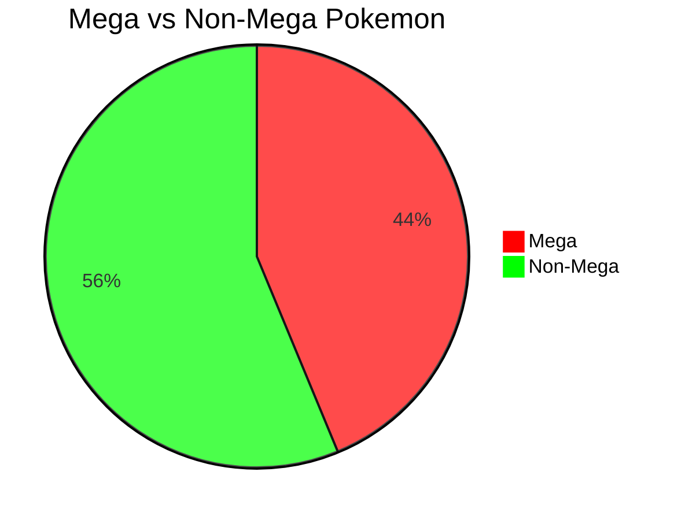
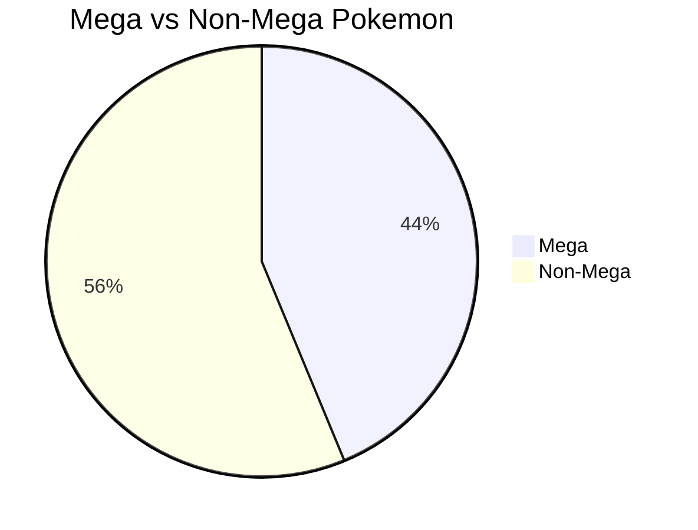
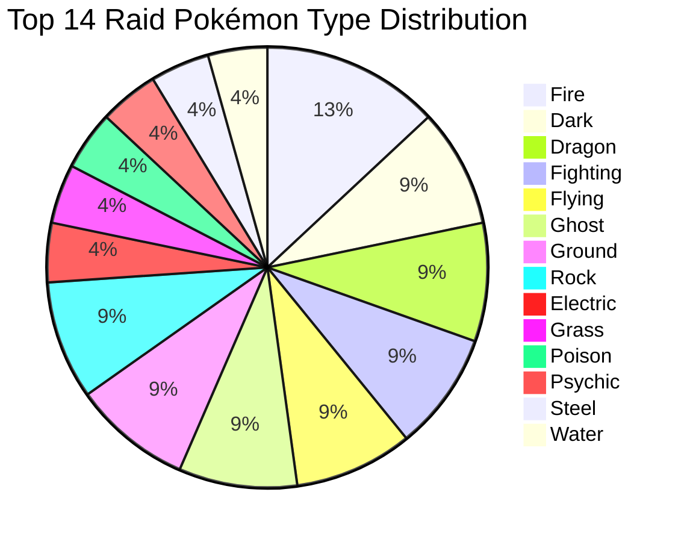

```mermaid
graph TD;
    A-->B;
    A-->C;
    B-->D;
    C-->D;
```

```mermaid
%%{init: {"themeVariables": {"pie1": "#ff0000", "pie2": "#00ff00"} }}%%
pie
    title Mega vs Non-Mega Pokemon
    "Mega" : 7
    "Non-Mega" : 9
```

```mermaid
pie
    title Mega vs Non-Mega Pokemon
    "Mega" : 7
    "Non-Mega" : 9
```

```mermaid
pie
    title Top 14 Raid Pokémon Type Distribution
    "Fire": 3
    "Dark": 2 
    "Dragon": 2 
    "Fighting": 2
    "Flying": 2
    "Ghost": 2 
    "Ground": 2 
    "Rock": 2 
    "Electric": 1 
    "Grass": 1
    "Poison": 1 
    "Psychic": 1 
    "Steel": 1 
    "Water": 1
```
